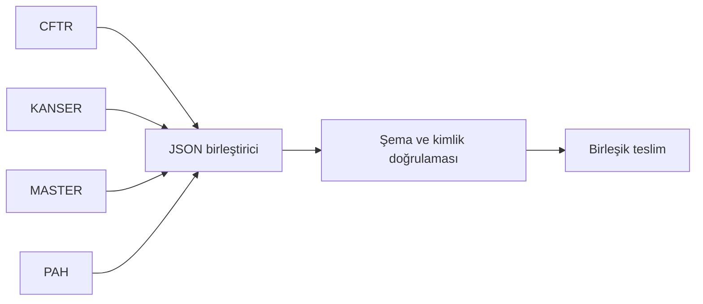
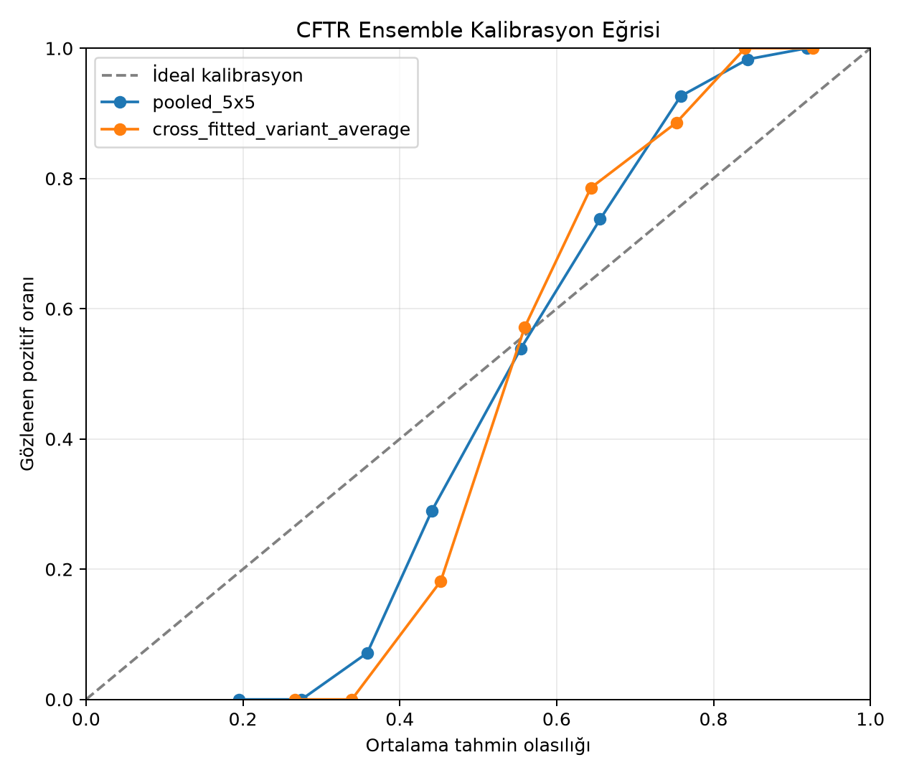
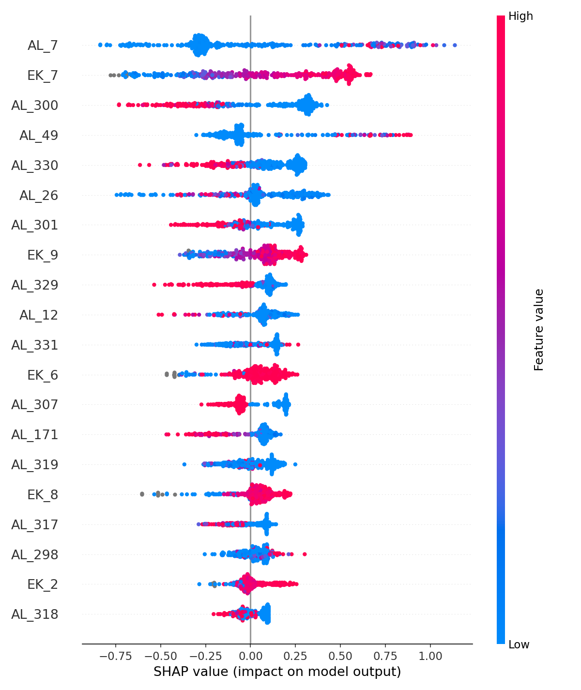

# GENOVA

**TEKNOFEST 2026 finalisti · Genel sıralama: 15.** GENOVA, takımımızın genetik varyantların patojenitesini tahmin etmek amacıyla geliştirdiği yapay zekâ projesidir. 1.500 takımın yer aldığı yarışmada finale yükselen 34 takımdan biri olduk ve final etabını genel sıralamada 15. sırada tamamladık.

Projede CFTR, KANSER, MASTER ve PAH panellerini bağımsız model hatlarında ele aldık. Her panel kendi tahminini üretirken `GENOVA_JSON_MERGER` bu çıktıları doğrulayıp tek bir teslim dosyasında birleştirir. Bu repo geliştirdiğimiz kodu, yöntem kararlarını ve analizleri bir araya getirir.

## Paneller

| Bileşen | Bu repodaki içerik |
| --- | --- |
| [CFTR](CFTR/README_PANEL_CFTR.md) | Final model hattı, model kartı ve kalibrasyon analizi |
| [KANSER](KANSER/README_PANEL_KANSER.md) | Final model hattı ve ön işleme çalışmaları |
| [MASTER](MASTER/README_PANEL_MASTER.md) | Final model hattı ve model seçimi raporları |
| [PAH](PAH/README_PANEL_PAH.md) | Final model hattı, deney notları ve yorumlanabilirlik grafikleri |
| [JSON birleştirici](GENOVA_JSON_MERGER/README.md) | Panel çıktılarının şema kontrolü ve birleştirilmesi |

## Veri ve yeniden üretim

**TÜSEB tarafından sağlanan test veri setleri bu repoda bulunmaz.** Dört panelin `input/<PANEL>.csv` dosyaları, diğer CSV'ler ve sonuç/tahmin JSON'ları public kopyadan çıkarılmıştır. Analiz metinleri ve grafikler inceleme amacıyla tutulmuştur. [Veri kullanılabilirliği](DATA_AVAILABILITY.md) dosyası kapsamı açıklar.

Panel betikleri kendi klasörlerinde `.venv` bekler. Sanal ortamlar da repoya eklenmemiştir. Her panelin beklediği Python sürümü ilgili panel README'sinde, bağımlılıkları `final/requirements.lock` dosyasında yer alır. Yetkili kullanıcı kendi girdisini sağladıktan sonra panel klasöründeki `RUN_PANEL.ps1` veya `RUN_PANEL.bat` dosyasını çalıştırabilir. Girdi olmadan final tahminleri yeniden üretilemez.

## Çalışmadan iki görsel

*CFTR panelinde tahmin olasılığı ile gözlenen pozitif oranının karşılaştırması.*

*PAH panelindeki özellik katkılarının özeti; değişken adları yarışma veri şemasındaki adlardır.*

## Sınırlar ve yayın kontrolü

Bu çalışma yarışma bağlamında geliştirilmiştir; klinik tanı aracı değildir. Klinik kullanım için bağımsız dış validasyon ve uzman değerlendirmesi gerekir.

Public gönderimden önce `python scripts/check_public_release.py` çalıştırın. Kontrol, çalışma ağacında ve varsa Git indeksinde CSV, ZIP, sonuç JSON'u veya sanal ortam bulunursa hata verir.
